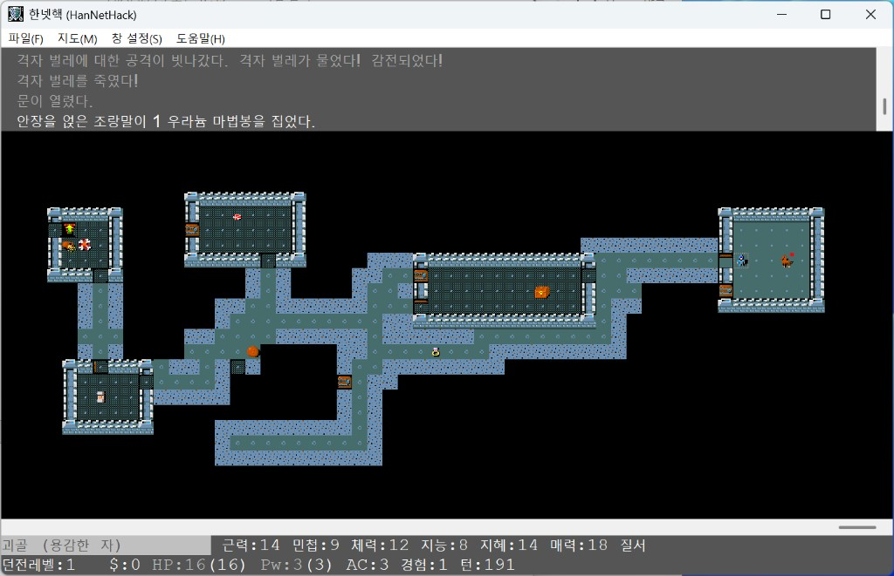

# HanNetHack — Korean NetHack


## 처음 오시는 분께

**HanNetHack**은 [NetHack](https://www.nethack.org/) 3.7을 바탕으로 한 **비공식 한국어 로컬라이즈 포크**입니다. NetHack DevTeam 공식 배포물이 아닙니다.

NetHack 3.7은 업스트림에서도 계속 개발·조정이 이루어지는 버전입니다. HanNetHack은 [NetHack/NetHack](https://github.com/NetHack/NetHack) 저장소의 **`NetHack-3.7`** 브랜치에 올라오는 변경을 가능할 때마다 가져와 이 포크에 병합합니다.

- **버그·오역·문구 개선 제안**: [GitHub Issues](https://github.com/timfr09/HanNetHack/issues)에 올려 주세요. (영문·한국어 모두 가능합니다.)
- **원본 게임**: 상위 프로젝트는 [NetHack on GitHub](https://github.com/NetHack/NetHack)입니다.

---

## Windows에서 릴리스 ZIP으로 플레이하기

1. [Releases](https://github.com/timfr09/HanNetHack/releases)에서 Windows용 포터블 ZIP을 받습니다. (GitHub Actions가 빌드한 패키지와 동일한 형식입니다.)
2. 원하는 폴더에 압축을 풉니다.
3. **`NetHackW.exe`** 를 실행하면 타일 GUI, **`NetHack.exe`** 는 콘솔(터미널) 버전입니다. 데이터와 번역은 ZIP 안에 포함되어 있습니다.
4. 설정은 사용자별 `NetHack\.nethackrc`(또는 배포 문서에 안내된 경로)에서 할 수 있습니다. 기본 언어는 한국어입니다. 영어로 바꾸려면 `OPTIONS=language:en` 등을 사용합니다.

빌드·번역·개발 정보는 아래 **Overview**와 **Korean translation system (brief)** 등을 참고하세요. (번역 파이프라인 요약은 영어로 적어 두었습니다.)



---

## Overview

**HanNetHack** is an unofficial, community-maintained Korean localization of NetHack 3.7 for Linux and Windows. It is **not** affiliated with the NetHack DevTeam.

NetHack 3.7 is still under active upstream development. This fork periodically merges new commits from the upstream [`NetHack-3.7`](https://github.com/NetHack/NetHack/tree/NetHack-3.7) branch when practical. Maintainer-oriented merge workflow: [`doc/i18n-upstream-merge.md`](doc/i18n-upstream-merge.md).

- **Bugs, translation mistakes, or wording feedback**: please file [GitHub Issues](https://github.com/timfr09/HanNetHack/issues).
- **Upstream source**: [NetHack/NetHack](https://github.com/NetHack/NetHack).

### Korean translation system (brief)

Source code uses GNU gettext-style macros (`_()`, `N_()`, `pgettext`, …). Translations are compiled to a standard **`.mo`** message catalog that is **bundled inside `nhdat`** at build time (not loaded from a separate locale directory next to the binary).

At runtime, strings are resolved through the in-tree reader **`src/mo_reader.c`**. The game **does not link against GNU `libintl`**.

- **Canonical translator-edited file in git:** `po/ko_manual.po`. A local `po/ko.po` produced by `make update-po` is an optional extraction/merge aid and is **not** committed.
- Korean help, rumors, Lua, and other locale assets live under **`dat/locale/ko/`**; when opening data files, **`dlb_fopen()`** prefers language-specific paths when present.
- Korean grammar markers in strings (topic/object particles, etc.) are interpreted by **`ko_postpos.c`**. Rules and tone guidelines: [`po/TRANSLATION_GUIDE_KO.md`](po/TRANSLATION_GUIDE_KO.md); APIs and pipeline: [`po/I18N_SYSTEM.md`](po/I18N_SYSTEM.md).

### Pre-built binaries

The easiest way to try the game is a release build from the [Releases](https://github.com/timfr09/HanNetHack/releases) page (Windows portable ZIPs are built by CI).

### Features (summary)

- Large-scale Korean UI and message translation (ongoing; `cd po && make stats`)
- Runtime Korean grammar (topic/subject/object markers, etc.) via a small postposition engine
- Speech-style-aware wording where the speaker warrants it
- UTF-8 display width handling on TTY and the Windows GUI
- Localized text in the Windows GUI character picker

### Build from source — Linux

```bash
git clone https://github.com/timfr09/HanNetHack.git
cd HanNetHack

cd sys/unix && sh setup.sh hints/linux.370 && cd ../..
make fetch-lua          # one-time: download Lua 5.4.8 source
make all                # do NOT use -j (Lua build can race)
make install            # installs to ~/nh/install/

HACKDIR=~/nh/install/games/lib/nethackdir TERM=xterm-256color ./src/nethack
```

### Build from source — Windows (Visual Studio)

The Windows GUI build (`NetHackW.exe`) and console build (`NetHack.exe`) are supported.

Prerequisite fetch steps (Lua, PDCursesMod, etc.) are unchanged; see [`sys/windows/build-hannethack.txt`](sys/windows/build-hannethack.txt).

**Makefiles:** `sys\windows\nhsetup.bat` installs Windows nmake rules into `src\` **without overwriting** an existing Unix-generated `src\Makefile`. It writes `src\Makefile.win` (and matching `GNUmakefile.win`). From `src\`, run:

```cmd
nmake /f Makefile.win package
```

To use the traditional NetHack layout (`nmake` with default `Makefile`), run:

```cmd
sys\windows\nhsetup.bat /install-makefile
cd src
nmake package
```

(`nhsetup.bat /im` is the short form. Legacy: `/overwrite`, `/o`.) Continuous integration uses `/install-makefile` so plain `nmake package` matches upstream expectations.

You can also open `sys\windows\vs\NetHack.sln` in Visual Studio. Optional gettext tools under `lib\gettext\bin` are only needed if you edit `po/*.po` or rebuild the `.mo` bundled into `nhdat` (`sys\windows\setup-gettext.cmd`).

After building, `sys\windows\install.cmd` stages a playable tree under `install\HanNetHack\`.

### Configuration

The game defaults to Korean. To switch language, edit `~/.nethackrc` or `%USERPROFILE%\NetHack\.nethackrc`:

```
OPTIONS=language:ko
OPTIONS=language:en
```

### Translation workflow

1. Edit **`po/ko_manual.po`** only (the canonical file committed to git).
2. `cd po && make compile` produces `dat/locale/ko/nethack.mo`.
3. Rebuild so `nhdat` picks up the catalog (`make all` on Linux after Unix setup; Windows as above).

Quick reference: [`po/README.md`](po/README.md). Korean style guide: [`po/TRANSLATION_GUIDE_KO.md`](po/TRANSLATION_GUIDE_KO.md). Maintainer merge notes: [`doc/i18n-upstream-merge.md`](doc/i18n-upstream-merge.md).

### Implementation notes (developers)

See **Korean translation system (brief)** above for architecture; [`po/I18N_SYSTEM.md`](po/I18N_SYSTEM.md) for full technical detail.

### Postposition reference

| Pattern    | Role              | Example (conceptual)   |
|------------|-------------------|-------------------------|
| `{은/는}`  | Topic marker      | dragon**은** / ant**는** |
| `{이/가}`  | Subject marker    | sword**이** / axe**가**  |
| `{을/를}`  | Object marker     | sword**을** / axe**를**  |
| `{과/와}`  | and / with        | sword**과** / shield**와** |
| `{으로/로}`| direction / means | north**으로** / down**로** |

### Versioning

HanNetHack uses semantic versioning with a Korean-translation suffix, e.g. `v3.7.0-ko.4` (based on NetHack 3.7.0, Korean iteration 4).

### License

NetHack General Public License (NGPL). See `dat/license`.

### Credits

- **Original NetHack**: [NetHack DevTeam](https://github.com/NetHack/NetHack)
- **Korean localization**: HanNetHack contributors

### Links

- [NetHack](https://www.nethack.org/)
- [HanNetHack Releases](https://github.com/timfr09/HanNetHack/releases)
