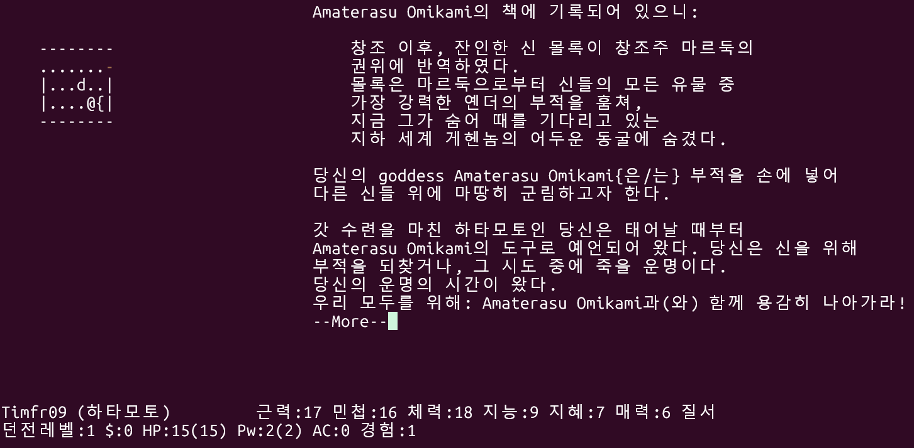

# HanNetHack - 한국어 NetHack


NetHack 3.7 기반의 한국어 번역 개인 프로젝트입니다.

> **Note**: This is an unofficial fan translation project, not affiliated with the NetHack DevTeam.

> **번역 오류 제보**: 아직 번역 오류가 있을 수 있습니다. 오류를 발견하시면 [Issues](https://github.com/timfr09/HanNetHack/issues)에 제보해 주세요!



---

## Features

### Korean Translation
- 10,000+ messages translated (work in progress)
- Dynamic postposition system for natural Korean grammar
- Speech style distinction (polite/casual/semi-polite)
- Consistent terminology across all game messages
- Word order optimized for natural Korean (positional format specifiers)
- Context-aware translations using `C_()` for shared strings
- Encyclopedia (data.base) Korean translation

### Enhanced Display
- Korean full-width symbol set
- Emoji symbol set
- CJK/UTF-8 character width handling

---

## Installation

### Build from Source

```bash
# Clone the repository
git clone https://github.com/timfr09/HanNetHack.git
cd HanNetHack

# Linux
cd sys/unix
sh setup.sh hints/linux
cd ../..
make all
make install

# The game will be installed to ~/nethack by default
```

### Pre-built Binaries

See [Releases](https://github.com/timfr09/HanNetHack/releases) for pre-built binaries.

---

## Configuration

### Language Setting

The game defaults to Korean. To change the language, edit `~/.nethackrc`:

```
OPTIONS=language:en    # English
OPTIONS=language:ko    # Korean (default)
```

### Symbol Sets

```
OPTIONS=symset:Korean  # Korean full-width symbols
OPTIONS=symset:Emoji   # Emoji symbols
OPTIONS=symset:IBMgraphics_langstripped  # ASCII
```

---

## Translation Details

### Postposition System

Korean requires different postpositions based on whether the preceding syllable ends with a consonant. HanNetHack automatically handles this:

| Pattern | Usage | Example |
|---------|-------|---------|
| `{은/는}` | Topic marker | 드래곤**은** / 개미**는** |
| `{이/가}` | Subject marker | 검**이** / 도끼**가** |
| `{을/를}` | Object marker | 검**을** / 도끼**를** |
| `{과/와}` | "and/with" | 검**과** / 방패**와** |
| `{으로/로}` | Direction/means | 북쪽**으로** / 아래**로** |

### Speech Styles

| Context | Style | Example |
|---------|-------|---------|
| User prompts | Polite | "무엇을 버리시겠습니까?" |
| Game narration | Casual | "배가 고프다." |
| Shopkeeper | Semi-polite | "계산해 주세요." |
| NPCs | Casual | "안녕." |

---

## Contributing

### Translation Improvements

1. Edit `po/ko_manual.po` with your translations (NOT `ko.po`)
2. Build the translation: `cd po && make merge compile`
3. Test in-game
4. Submit a pull request

> **Note**: `ko_manual.po` is the safe file for manual edits. `ko.po` can be overwritten by `make update-po`.

See `po/README.md` for detailed translation workflow.

### Reporting Issues

Please report translation errors or suggestions on [GitHub Issues](https://github.com/timfr09/HanNetHack/issues).

---

## Versioning

HanNetHack uses semantic versioning with Korean translation suffix:

```
v3.7.0-ko.4
  │    │  └── Korean translation version
  │    └───── Based on NetHack 3.7.0
  └────────── Major version
```

---

## License

NetHack General Public License (NGPL)

See `dat/license` for details.

---

## Credits

- **Original NetHack**: [NetHack DevTeam](https://github.com/NetHack/NetHack)
- **Korean Translation**: HanNetHack Project

---

## Links

- [Original NetHack](https://nethack.org/)
- [NetHack GitHub](https://github.com/NetHack/NetHack)
- [HanNetHack Releases](https://github.com/timfr09/HanNetHack/releases)
